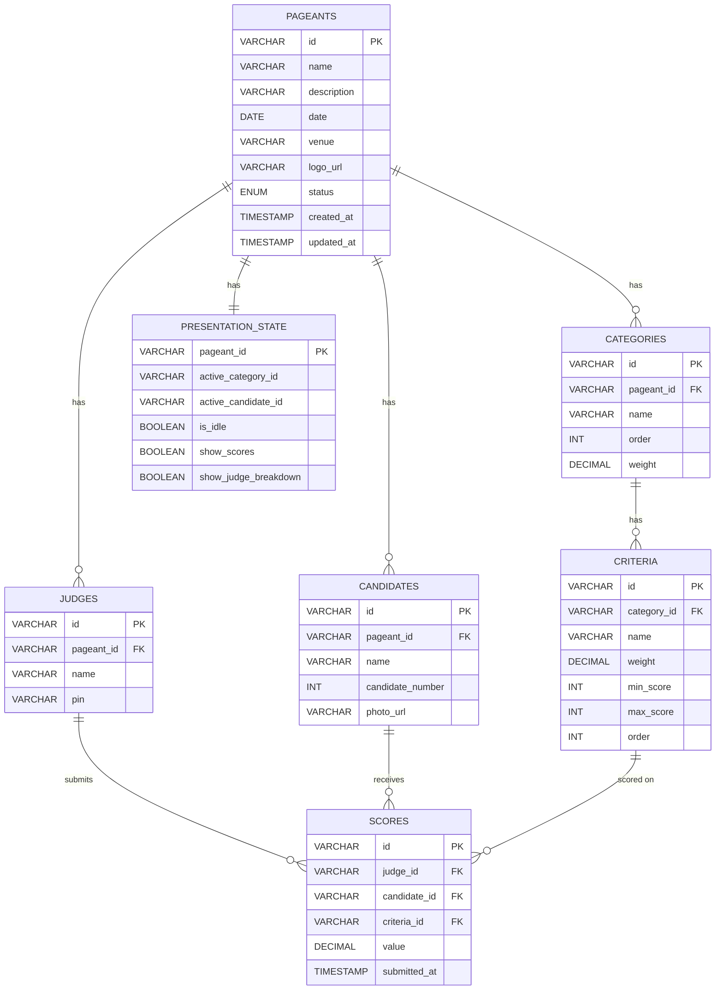

<div align="center">

# 👑 Pageant Management System

**A real-time, multi-app pageant scoring platform built as a monorepo.**

[](#-docker-deployment)
[](#tech-stack)
[](#tech-stack)
[](#tech-stack)
[](#tech-stack)
[](#tech-stack)

*Judges score from their phones. The audience sees it live. The admin controls everything.*

</div>

---

## 📋 Table of Contents

- [Overview](#-overview)
- [Architecture](#-architecture)
- [Apps](#-apps)
- [Tech Stack](#tech-stack)
- [Getting Started](#-getting-started)
- [Docker Deployment](#-docker-deployment)
- [Environment Variables](#-environment-variables)
- [Project Structure](#-project-structure)
- [API Reference](#-api-reference)
- [Socket.IO Events](#-socketio-events)
- [Database Schema](#-database-schema)
- [Authentication](#-authentication)
- [Development](#-development)
- [License](#-license)

---

## 🎯 Overview

The Pageant Management System is a full-featured, real-time scoring platform designed for beauty pageants, talent shows, and similar judged competitions. It replaces traditional paper-based scoring and spreadsheet-driven workflows with a seamless digital experience.

### Key Features

| Feature | Description |
|---------|-------------|
| **Real-Time Scoring** | Judges submit scores from their devices; results appear instantly on the tabulator dashboard |
| **Live Audience View** | A cinematic, full-screen display for projectors showing the active candidate and animated score reveals |
| **Admin Control** | Full control over pageant configuration, candidate presentation order, and score visibility |
| **Criteria & Rules** | Define scoring criteria with min/max constraints and percentage weights |
| **Dockerized** | One command to deploy all services, accessible across the local network |

---

## 🏗 Architecture

The system is built as a **monorepo** with 5 apps and 3 shared packages, orchestrated via Docker Compose with an Nginx reverse proxy.

```
┌─────────────────────────────────────────────────────────────────┐
│                        Nginx (port 80)                          │
│          Reverse Proxy — routes by URL path prefix              │
├─────────┬──────────┬──────────────┬───────────┬─────────────────┤
│ /admin  │  /view   │ /tabulator   │  /judge   │ /api /socket.io │
│         │          │              │           │                 │
│ React   │  React   │   React      │  React    │ Express +       │
│ Vite    │  Vite    │   Vite       │  Vite     │ Socket.IO       │
│ :5173   │  :5174   │   :5175      │  :5176    │ :3001           │
└─────────┴──────────┴──────────────┴───────────┴────────┬────────┘
                                                         │
                                                    ┌────▼────┐
                                                    │ MySQL 8 │
                                                    │  :3306  │
                                                    └─────────┘
```

All apps are accessible from **any device on the same network** via the host machine's IP address.

---

## 📱 Apps

### 🛡 Admin (`/admin`)

The master control panel for pageant organizers.

- **Login:** Username + password authentication
- **Pageant Management:** Create and configure pageant events (name, date, venue, logo)
- **Categories:** Define scoring categories with percentage weights (e.g., Swimwear 30%, Evening Gown 25%)
- **Criteria:** Set scoring criteria per category with min/max score rules and individual weights
- **Candidates:** Add candidates with name, number, and photo upload
- **Judges:** Create judges with names and unique PIN codes
- **Live Control:** Select which candidate is currently on display, toggle idle screen, reveal/hide scores
- **Results:** View aggregated scores and final rankings

### 📺 Audience View (`/view`)

A cinematic, full-screen display designed for projectors and large screens.

- **No authentication required** — publicly accessible
- **Idle Mode:** Displays event branding and logo with smooth animations
- **Candidate Spotlight:** Full-screen candidate photo with name and number
- **Score Reveal:** Animated score cards with dramatic number counting effects
- **Fully controlled by Admin** — no user interaction needed

### 📊 Tabulator (`/tabulator`)

Real-time scoring dashboard for the tabulation team.

- **Scoring Matrix:** Live table showing Candidates × Judges with scores
- **Status Tracking:** Visual indicators for submitted ✅ vs. pending ⏳ scores
- **Manual Override:** Ability to manually enter or correct scores
- **Score Locking:** Lock scoring per category after all judges submit
- **Live Rankings:** Auto-computed weighted totals and rankings

### ⚖️ Judge (`/judge`)

Mobile-first scoring interface for judges.

- **PIN Authentication:** Enter PIN → receive JWT token for the session
- **Active Candidate:** Automatically shows the candidate currently set by admin
- **Criteria Scoring:** Each criterion displays its name, weight, and allowed score range
- **Validation:** Input constrained to min/max rules defined by admin
- **Submit & Lock:** Once submitted, scores are locked unless the tabulator unlocks them
- **Waiting State:** "Waiting for next candidate..." between scoring rounds

---

## Tech Stack

| Layer | Technology |
|-------|-----------|
| **Frontend** | React 19, Vite 7, TailwindCSS 4 |
| **Backend** | Express 5, Socket.IO 4 |
| **Database** | MySQL 8 |
| **Language** | TypeScript 5.9 |
| **Auth** | JWT (judges), Session-based (admin) |
| **Proxy** | Nginx |
| **Container** | Docker, Docker Compose |
| **Monorepo** | npm Workspaces |

---

## 🚀 Getting Started

### Prerequisites

- [Docker](https://docs.docker.com/get-docker/) & [Docker Compose](https://docs.docker.com/compose/install/)
- [Node.js](https://nodejs.org/) ≥ 20 (for local development only)

### Quick Start with Docker

```bash
# 1. Clone the repository
git clone https://github.com/Markrodriguez1105/Live-Score-Board.git
cd Live-Score-Board

# 2. Configure environment variables
# Create a .env file with your preferred passwords and secrets (see Environment Variables below)

# 3. Build and start all services
docker compose up --build

# 4. Access the apps
# Admin:      http://localhost/admin
# View:       http://localhost/view
# Tabulator:  http://localhost/tabulator
# Judge:      http://localhost/judge
```

### Accessing from Other Devices

Find your host machine's local IP address:

```bash
# Windows
ipconfig

# macOS / Linux
ifconfig
```

Then access from any device on the same network:

```
http://192.168.1.100/admin      # Admin panel
http://192.168.1.100/view       # Audience display (projector)
http://192.168.1.100/tabulator  # Tabulation dashboard
http://192.168.1.100/judge      # Judge scoring (phone)
```

---

## 🐳 Docker Deployment

### Services

| Service | Image | Port | Description |
|---------|-------|------|-------------|
| `nginx` | nginx:alpine | 80 | Reverse proxy, routes all traffic |
| `server` | Custom (Node) | 3001 | REST API + Socket.IO backend |
| `mysql` | mysql:8 | 3306 | Database |
| `admin` | Custom (Nginx) | 5173 | Admin SPA |
| `view` | Custom (Nginx) | 5174 | Viewer SPA |
| `tabulator` | Custom (Nginx) | 5175 | Tabulator SPA |
| `judge` | Custom (Nginx) | 5176 | Judge SPA |

### Commands

```bash
# Start all services
docker compose up -d

# Start with rebuild
docker compose up --build -d

# View logs
docker compose logs -f

# View logs for a specific service
docker compose logs -f server

# Stop all services
docker compose down

# Stop and remove volumes (⚠️ deletes database)
docker compose down -v

# Restart a single service
docker compose restart server
```

### Volumes

| Volume | Purpose |
|--------|---------|
| `mysql_data` | Persistent MySQL database storage |
| `uploads` | Candidate photo uploads |

---

## 🔐 Environment Variables

Create a `.env` file in the project root:

```env
# Database
MYSQL_ROOT_PASSWORD=your_secure_password

# JWT (for judge authentication)
JWT_SECRET=your-random-jwt-secret-key

# Admin credentials
ADMIN_USERNAME=admin
ADMIN_PASSWORD=your_admin_password
```

| Variable | Required | Description |
|----------|----------|-------------|
| `MYSQL_ROOT_PASSWORD` | ✅ | MySQL root password |
| `JWT_SECRET` | ✅ | Secret key for signing judge JWT tokens |
| `ADMIN_USERNAME` | ✅ | Admin login username |
| `ADMIN_PASSWORD` | ✅ | Admin login password |

---

## 📁 Project Structure

```
Live Score Board/
├── docker-compose.yml          # Container orchestration
├── nginx.conf                  # Reverse proxy configuration
├── package.json                # Workspace root
├── tsconfig.base.json          # Shared TypeScript config
├── .env                        # Environment variables
│
├── packages/                   # Shared packages
│   ├── types/                  # TypeScript interfaces & types
│   │   └── src/index.ts
│   ├── database/               # MySQL schema, queries, connection
│   │   └── src/
│   │       ├── index.ts        # Connection pool
│   │       ├── schema.ts       # Table definitions
│   │       ├── queries.ts      # Data access layer
│   │       └── seed.ts         # Development seed data
│   └── ui/                     # Shared React components
│       └── src/components/
│           ├── CandidateCard.tsx
│           ├── ScoreDisplay.tsx
│           ├── CategoryBadge.tsx
│           ├── LoadingSpinner.tsx
│           ├── IdleScreen.tsx
│           ├── ScoreBar.tsx
│           ├── Modal.tsx
│           └── Toast.tsx
│
├── apps/                       # Application services
│   ├── server/                 # Express + Socket.IO backend
│   │   ├── Dockerfile
│   │   └── src/
│   │       ├── index.ts        # Entry point
│   │       ├── socket.ts       # WebSocket handlers
│   │       ├── routes/         # REST API endpoints
│   │       └── middleware/     # Auth, file upload
│   │
│   ├── admin/                  # Admin dashboard
│   │   ├── Dockerfile
│   │   └── src/pages/
│   │       ├── LoginPage.tsx
│   │       ├── DashboardPage.tsx
│   │       ├── PageantDetailPage.tsx
│   │       ├── CategoriesPage.tsx
│   │       ├── CandidatesPage.tsx
│   │       ├── JudgesPage.tsx
│   │       ├── LiveControlPage.tsx
│   │       └── ResultsPage.tsx
│   │
│   ├── view/                   # Audience display
│   │   ├── Dockerfile
│   │   └── src/pages/
│   │       └── ViewerPage.tsx
│   │
│   ├── tabulator/              # Tabulation dashboard
│   │   ├── Dockerfile
│   │   └── src/pages/
│   │       ├── LoginPage.tsx
│   │       └── ScoringDashboard.tsx
│   │
│   └── judge/                  # Judge scoring app
│       ├── Dockerfile
│       └── src/pages/
│           ├── PinEntryPage.tsx
│           └── ScoringPage.tsx
│
└── uploads/                    # Candidate photo storage
```

---

## 📡 API Reference

Base URL: `http://<host>/api`

### Pageants

| Method | Endpoint | Auth | Description |
|--------|----------|------|-------------|
| `GET` | `/api/pageants` | Admin | List all pageants |
| `POST` | `/api/pageants` | Admin | Create a pageant |
| `GET` | `/api/pageants/:id` | Admin | Get pageant details |
| `PUT` | `/api/pageants/:id` | Admin | Update a pageant |
| `DELETE` | `/api/pageants/:id` | Admin | Delete a pageant |

### Categories & Criteria

| Method | Endpoint | Auth | Description |
|--------|----------|------|-------------|
| `GET` | `/api/pageants/:id/categories` | Admin | List categories |
| `POST` | `/api/pageants/:id/categories` | Admin | Create a category (with weight %) |
| `PUT` | `/api/categories/:id` | Admin | Update category |
| `DELETE` | `/api/categories/:id` | Admin | Delete category |
| `GET` | `/api/categories/:id/criteria` | Admin | List criteria |
| `POST` | `/api/categories/:id/criteria` | Admin | Create criterion (weight, min/max score) |
| `PUT` | `/api/criteria/:id` | Admin | Update criterion |
| `DELETE` | `/api/criteria/:id` | Admin | Delete criterion |

### Candidates

| Method | Endpoint | Auth | Description |
|--------|----------|------|-------------|
| `GET` | `/api/pageants/:id/candidates` | Admin | List candidates |
| `POST` | `/api/pageants/:id/candidates` | Admin | Create candidate |
| `PUT` | `/api/candidates/:id` | Admin | Update candidate |
| `DELETE` | `/api/candidates/:id` | Admin | Delete candidate |
| `POST` | `/api/candidates/:id/photo` | Admin | Upload candidate photo |

### Judges

| Method | Endpoint | Auth | Description |
|--------|----------|------|-------------|
| `GET` | `/api/pageants/:id/judges` | Admin | List judges |
| `POST` | `/api/pageants/:id/judges` | Admin | Create judge (name + PIN) |
| `DELETE` | `/api/judges/:id` | Admin | Remove judge |
| `POST` | `/api/judges/auth` | Public | Authenticate with PIN → JWT |

### Scores

| Method | Endpoint | Auth | Description |
|--------|----------|------|-------------|
| `POST` | `/api/scores` | JWT (Judge) | Submit scores |
| `PUT` | `/api/scores/:id` | Admin/Tab | Override a score |
| `GET` | `/api/pageants/:id/results` | Admin/Tab | Get aggregated results |

### Presentation

| Method | Endpoint | Auth | Description |
|--------|----------|------|-------------|
| `GET` | `/api/pageants/:id/presentation` | Public | Get current presentation state |
| `PUT` | `/api/pageants/:id/presentation` | Admin | Update presentation state |

---

## ⚡ Socket.IO Events

### Server → Client

| Event | Payload | Description |
|-------|---------|-------------|
| `presentation:update` | `PresentationState` | Active candidate, idle state, score visibility changed |
| `scores:update` | `{ candidateId, scores[] }` | New score submitted or updated |
| `scores:locked` | `{ categoryId, candidateId }` | Scoring locked for a candidate/category |

### Client → Server

| Event | Payload | Auth | Description |
|-------|---------|------|-------------|
| `judge:submit-score` | `{ candidateId, scores[{ criteriaId, value }] }` | JWT | Judge submits scores |
| `admin:set-presentation` | `Partial<PresentationState>` | Admin | Update what's displayed |
| `tabulator:override-score` | `{ judgeId, candidateId, criteriaId, value }` | Admin | Tabulator corrects a score |

---

## 🗄 Database Schema

### Entity Relationship



### Scoring Formula

```
Candidate Total = Σ (category_weight × Σ (criteria_weight × judge_avg_score))
```

Where:
- **Category Weight:** Percentage weight of the category (e.g., 30%)
- **Criteria Weight:** Percentage weight within the category (e.g., 40%)
- **Judge Avg Score:** Average of all judges' scores for that criterion, normalized to the min/max range

---

## 🔒 Authentication

### Admin & Tabulator

- **Method:** Username + password → server-side session
- **No JWT** — session cookie is used
- **Credentials** are set via environment variables (`ADMIN_USERNAME`, `ADMIN_PASSWORD`)

### Judge

- **Method:** PIN → JWT token
- **Flow:**
  1. Judge enters their PIN on the login screen
  2. Server validates PIN against the `judges` table
  3. Server issues a JWT containing `{ judgeId, pageantId }`
  4. Client stores the token and includes it in all API requests and WebSocket connections
  5. Token expiry is set for the duration of the event

### Audience View

- **No authentication** — publicly accessible on the network

---

## 💻 Development

### Local Development (without Docker)

```bash
# Install all dependencies
npm install

# Start all services concurrently
npm run dev

# Or start individual services
npm run dev:server     # API server on :3001
npm run dev:admin      # Admin app on :5173
npm run dev:view       # Viewer app on :5174
npm run dev:tabulator  # Tabulator on :5175
npm run dev:judge      # Judge app on :5176
```

> **Note:** For local development, you'll need a MySQL instance running. You can start just the database container:
> ```bash
> docker compose up mysql -d
> ```

### Seed Data

```bash
# Populate database with sample data for development
npm run db:seed
```

### Build

```bash
# Build all packages and apps
npm run build
```

### Workspace Commands

```bash
# Run a command in a specific workspace
npm run dev -w apps/server
npm run build -w apps/admin

# Install a dependency in a specific workspace
npm install axios -w apps/admin

# Install a shared dev dependency at the root
npm install -D prettier -w .
```

---

## 📄 License

This project is private and proprietary.
